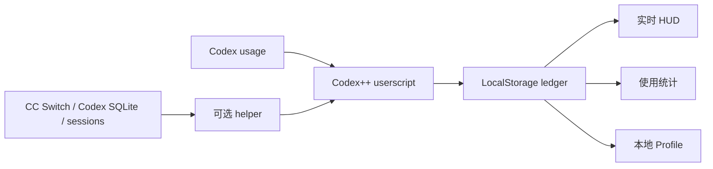

# Codex Token Cost

<p align="center">
  <strong>Codex++ 本地 Token、费用与使用趋势面板</strong><br>
  <sub>实时 HUD、本地 Profile、模型定价和可选 helper，数据始终留在本机。</sub>
</p>

<p align="center">
  <code>v0.7.1</code>
  &nbsp;·&nbsp;
  <code>Windows / macOS</code>
  &nbsp;·&nbsp;
  <code>Local-first</code>
  &nbsp;·&nbsp;
  <code>Codex++ UserScript</code>
</p>


Codex Token Cost 是一个面向 [Codex++](https://github.com/BigPizzaV3/CodexPlusPlus) 的本地 userscript。它在 Codex 输入区上方展示本轮、当前会话、缓存命中、费用和今日累计，并提供独立使用统计、模型价格管理及本地 Profile 数据。

主脚本可独立运行。可选 helper 用于补充 CC Switch、Codex SQLite 会话数和 skill / plugin 统计。

## 核心能力

| 能力 | 说明 |
|---|---|
| 实时 HUD | 展示本轮输入/输出、会话累计、缓存命中、会话费用和今日费用 |
| 使用统计 | 支持今日、7 天、30 天和自定义日期范围，提供趋势、环比、Token 构成和模型筛选 |
| 本地 Profile | 解锁 Codex Profile，并使用本地统计替代不可用的云端资料 |
| 模型定价 | 按 USD / 1M tokens 管理输入、读缓存、写缓存和输出价格 |
| CC Switch 同步 | 通过可选 helper 合并 CC Switch 历史与近期小时趋势 |
| 本地优先 | usage、价格和 Profile 配置保存在本机，不上传项目内容或认证信息 |

## 功能展示

### 使用统计

统一复用 HUD、Profile 和 CC Switch 的本地去重口径。支持 Token / 花费切换、时间范围筛选、模型联动和缓存命中分析。


### 本地 Profile

解锁 Codex 个人 Profile，展示本地累计 Token、活跃热力图、连续使用天数、推理强度以及 skill / plugin 使用情况。


### 模型价格

内置常用模型价格，并允许为新模型添加或覆盖本地定价。缓存读取和缓存写入分别计价。


### 数据与显示

HUD 可随时关闭；helper 不可用时自动降级到 userscript 本地捕获，不影响基础统计。


## 工作方式



## 快速安装

### Windows

```powershell
powershell -NoProfile -ExecutionPolicy Bypass -File .\scripts\deploy-userscript.ps1
```

### macOS

```sh
sh ./scripts/deploy-userscript.sh
```

安装后重启 Codex，或重新加载 Codex++ 用户脚本。

## 可选 helper

helper 默认监听 `127.0.0.1:17888`。不开启 helper 时，实时 HUD、本地 ledger、使用统计和 Profile 仍然可用。

| helper 能力 | 未启动时 |
|---|---|
| CC Switch 同步 | 不可用 |
| Codex SQLite 会话数 | 使用本地 ledger 兜底 |
| skill / plugin 统计 | 不可用 |
| HUD 与本地 Profile | 正常工作 |

### 手动启动

Windows：

```powershell
powershell -NoProfile -ExecutionPolicy Bypass -File .\scripts\start-helper.ps1
```

macOS：

```sh
sh ./scripts/start-helper.sh
```

### 健康检查

Windows：

```powershell
Invoke-RestMethod http://127.0.0.1:17888/stats
```

macOS：

```sh
curl -fsS http://127.0.0.1:17888/stats
```

<details>
<summary>Windows 登录时自动启动</summary>

```powershell
$script = (Resolve-Path .\scripts\start-helper.ps1).Path
$action = New-ScheduledTaskAction -Execute "powershell.exe" -Argument "-NoProfile -ExecutionPolicy Bypass -WindowStyle Hidden -File `"$script`""
$trigger = New-ScheduledTaskTrigger -AtLogOn
$settings = New-ScheduledTaskSettingsSet -AllowStartIfOnBatteries -DontStopIfGoingOnBatteries
Register-ScheduledTask -TaskName "CodexTokenCostHelper" -Action $action -Trigger $trigger -Settings $settings -Description "Start Codex Token Cost local helper" -Force
Start-ScheduledTask -TaskName "CodexTokenCostHelper"
```

取消：

```powershell
Unregister-ScheduledTask -TaskName "CodexTokenCostHelper" -Confirm:$false
```

</details>

<details>
<summary>macOS 登录时自动启动</summary>

```sh
mkdir -p "$HOME/Library/LaunchAgents"
cat > "$HOME/Library/LaunchAgents/com.tianzora.codex-token-cost-helper.plist" <<'PLIST'
<?xml version="1.0" encoding="UTF-8"?>
<!DOCTYPE plist PUBLIC "-//Apple//DTD PLIST 1.0//EN" "https://www.apple.com/DTDs/PropertyList-1.0.dtd">
<plist version="1.0">
<dict>
  <key>Label</key>
  <string>com.tianzora.codex-token-cost-helper</string>
  <key>ProgramArguments</key>
  <array>
    <string>/bin/sh</string>
    <string>REPO_PATH/scripts/start-helper.sh</string>
  </array>
  <key>EnvironmentVariables</key>
  <dict>
    <key>PATH</key>
    <string>/opt/homebrew/bin:/usr/local/bin:/usr/bin:/bin:/usr/sbin:/sbin</string>
  </dict>
  <key>RunAtLoad</key>
  <true/>
  <key>KeepAlive</key>
  <false/>
  <key>StandardOutPath</key>
  <string>/tmp/codex-token-cost-helper.launchd.log</string>
  <key>StandardErrorPath</key>
  <string>/tmp/codex-token-cost-helper.launchd.err</string>
</dict>
</plist>
PLIST
REPO_PATH="$(pwd)" perl -0pi -e 's|REPO_PATH|$ENV{REPO_PATH}|g' "$HOME/Library/LaunchAgents/com.tianzora.codex-token-cost-helper.plist"
launchctl bootstrap "gui/$(id -u)" "$HOME/Library/LaunchAgents/com.tianzora.codex-token-cost-helper.plist"
launchctl kickstart -k "gui/$(id -u)/com.tianzora.codex-token-cost-helper"
```

取消：

```sh
launchctl bootout "gui/$(id -u)" "$HOME/Library/LaunchAgents/com.tianzora.codex-token-cost-helper.plist" 2>/dev/null || true
rm -f "$HOME/Library/LaunchAgents/com.tianzora.codex-token-cost-helper.plist"
```

</details>

## 项目结构

```text
scripts/
  codex-live-token-cost.js          Codex++ 主脚本
  codex-local-usage-helper.cjs      可选本地 helper
  deploy-userscript.ps1             Windows 部署脚本
  deploy-userscript.sh              macOS 部署脚本
  start-helper.ps1                  Windows helper 启动脚本
  start-helper.sh                   macOS helper 启动脚本
tests/
  codex-live-token-cost.test.cjs
  codex-local-usage-helper.test.cjs
```

## 环境要求

- Codex 桌面端
- Codex++
- Windows 或 macOS
- Node.js，仅 helper 需要
- Python 3 或可用的 `python`，仅 helper 读取 SQLite 时需要

## 隐私

- 主脚本只写入 Codex WebView 的 `localStorage`。
- helper 只读取本机 Codex session、Codex SQLite 和 CC Switch 数据。
- 仓库不保存 API key、cookie、session token 或真实云端账号 ID。
